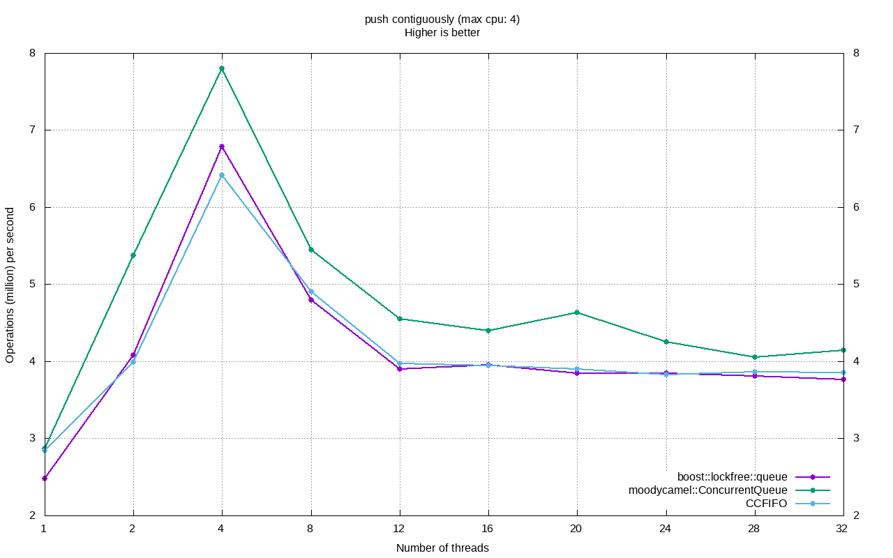
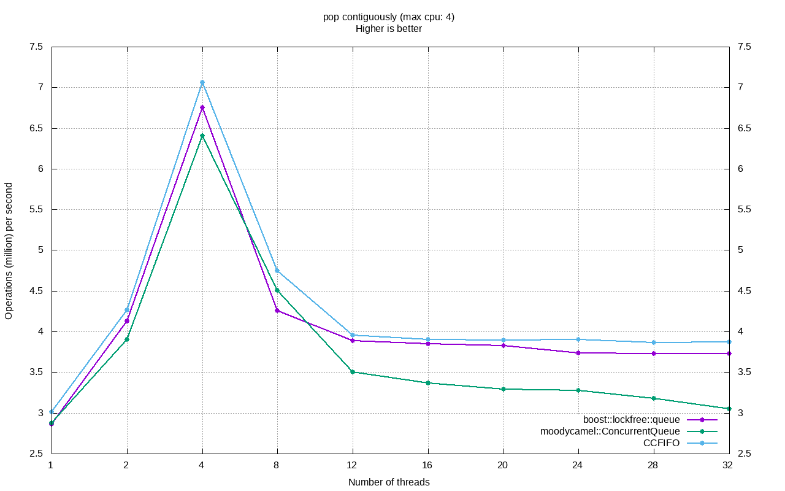
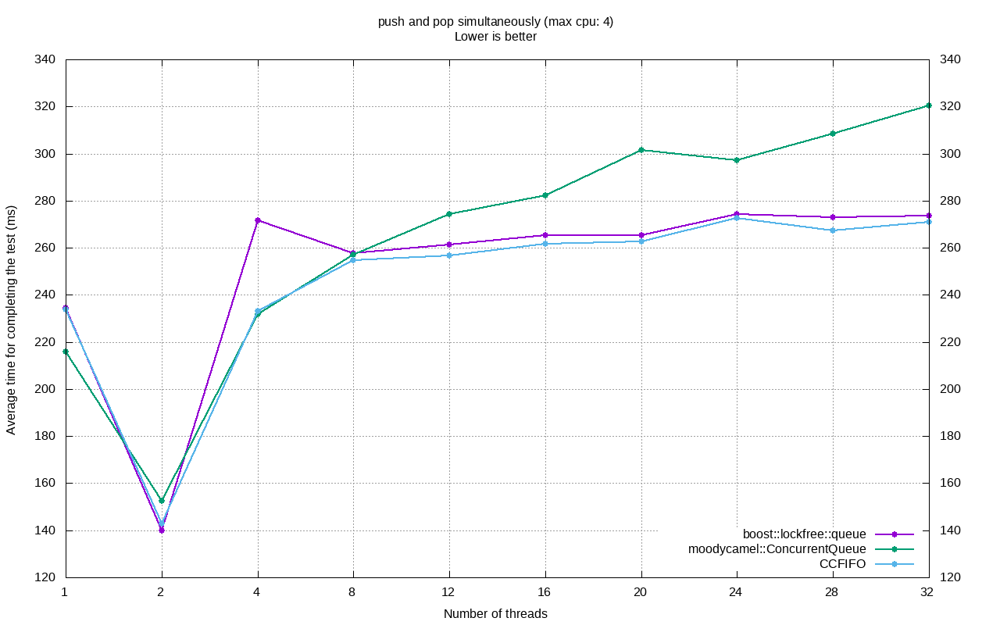

Utilities & Logging Library
----

## Prerequisites

### tools

```
sudo apt install -y curl ninja-build && \
wget https://github.com/Kitware/CMake/releases/download/v3.21.3/cmake-3.21.3-Linux-x86_64.sh; \
chmod +x cmake-3.21.3-Linux-x86_64.sh; \
sudo ./cmake-3.21.3-Linux-x86_64.sh --skip-license --prefix=/usr/; sudo ldconfig


git clone git@github.com:google/googletest.git -b release-1.11.0 && 
cd googletest && { cmake -GNinja -B.build -DBUILD_SHARED_LIBS=ON && cmake --build .build && sudo cmake --install .build; cd ..; sudo ldconfig; }
```

### submodules

`git submodule update --init --recursive`

## Benchmark




## Plot
plot.sh <file> 1

TODO
---
slogger

License
----
MIT
